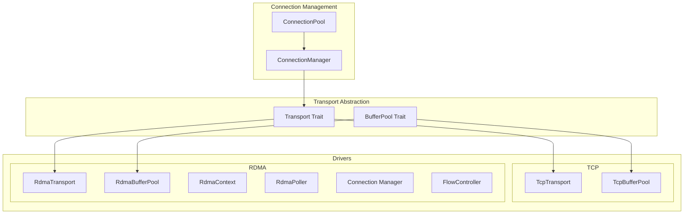

# net-rs

A high-performance, abstracted network layer for Rust, designed for thread-per-core architectures (based on [monoio](https://github.com/bytedance/monoio)). It supports multiple transport backends (TCP and RDMA) through a unified trait-based interface, enabling zero-copy data transfer and efficient connection management.

## Features

- **Unified Async Transport**: `Transport` and `BufferPool` traits for abstracting over TCP and RDMA.
- **Thread-Per-Core Optimized**: Built for `monoio`, using `Rc`/`RefCell` to avoid lock contention.
- **TCP Driver**: Length-prefixed messaging over async TCP streams.
- **RDMA Driver**: High-performance implementation using the `sideway` crate.
  - **Zero-Copy**: Integrated slab allocator with pre-registered memory regions.
  - **Flow Control**: Credit-based mechanism to prevent receiver buffer overrun.
  - **Signal Batching**: Smart signaling to reduce completion queue overhead.
  - **Async Poller**: Efficient completion handling integrated with io_uring.
- **Connection Management**: `ConnectionPool` and `ConnectionManager` with TTL and exponential backoff.

## Architecture Overview



---

## Crate Structure

```
src/
├── lib.rs              # Crate root and exports
├── transport/          # Transport and BufferPool traits
├── pool/               # ConnectionPool and ConnectionManager
├── drivers/            # TCP and RDMA implementations
└── memory/             # Slab allocator and RDMA memory registration
```

---

## Core Abstractions

### Transport Trait

The `Transport` trait provides a unified interface for network communication:

```rust
#[async_trait(?Send)]
pub trait Transport: 'static {
    /// Send a buffer to the peer
    async fn send(&self, buf: Bytes) -> io::Result<()>;

    /// Receive a message from the peer
    async fn recv(&self) -> io::Result<Bytes>;

    /// Allocate a buffer compatible with this transport
    fn alloc_buf(&self, size: usize) -> BytesMut;
}
```

**Key characteristics:**
- `?Send` bound for thread-per-core compatibility.
- Message-oriented: `recv()` returns complete frames.
- Transport-aware allocation via `alloc_buf()` for zero-copy support.

### BufferPool Trait

```rust
pub trait BufferPool: 'static {
    fn alloc(&self, size: usize) -> BytesMut;
}
```

Abstracts buffer allocation:
- **TCP**: Standard heap allocation.
- **RDMA**: Allocates from registered memory regions (MRs) for zero-copy.

---

## Usage Examples

### TCP Transport

```rust
use monoio::net::TcpStream;
use net_rs::drivers::tcp::transport::TcpTransport;
use net_rs::transport::Transport;

async fn example() -> io::Result<()> {
    let stream = TcpStream::connect("127.0.0.1:8080").await?;
    let transport = TcpTransport::new(stream);
    
    // Send
    let mut buf = transport.alloc_buf(128);
    buf.extend_from_slice(b"hello");
    transport.send(buf.freeze()).await?;
    
    // Receive
    let response = transport.recv().await?;
    Ok(())
}
```

### RDMA Transport

```rust
use net_rs::drivers::rdma::{RdmaTransport, TransportConfig};
use net_rs::drivers::rdma::cm;
use net_rs::transport::Transport;

async fn example() -> io::Result<()> {
    let config = TransportConfig::new()
        .with_max_outstanding_sends(64)
        .with_send_signal_batch(16);
    
    let transport = cm::connect_with_config(
        "192.168.1.100:9999".parse().unwrap(),
        Duration::from_secs(5),
        config,
    ).await?;
    
    // Use the same Transport trait
    let mut buf = transport.alloc_buf(4096);
    buf.extend_from_slice(b"rdma data");
    transport.send(buf.freeze()).await?;
    
    Ok(())
}
```

### Connection Pool

```rust
use net_rs::pool::ConnectionPool;
use net_rs::drivers::tcp::transport::TcpTransport;
use std::time::Duration;
use std::net::SocketAddr;

async fn example() -> io::Result<()> {
    let pool: ConnectionPool<SocketAddr, TcpTransport> = 
        ConnectionPool::new(Duration::from_secs(60));
    
    // Insert connection
    let addr = "127.0.0.1:8080".parse().unwrap();
    let transport = TcpTransport::new(TcpStream::connect(addr).await?);
    pool.insert(addr, transport).await;
    
    // Get cached connection
    if let Some(conn) = pool.get(&addr).await {
        conn.send(data).await?;
    }
    
    Ok(())
}
```

---

## Dependencies

| Crate | Purpose |
|-------|---------|
| `monoio` | Async runtime (io_uring based) |
| `bytes` | Buffer management |
| `async_trait` | Async trait support |
| `flume` | Channel communication |
| `rustc-hash` | Fast hash maps |
| `sideway` | RDMA verbs bindings (feature-gated) |

## License

MIT
